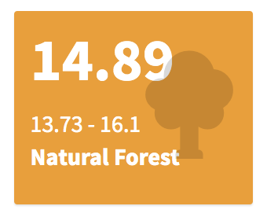
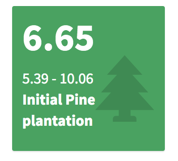

# Introduction 
This is a reference manual of the app DiveRpine which includes how each step compute the diversity ... 

It also provides some function's tests and some partial results 

```{r setup, include=FALSE}
knitr::opts_chunk$set(echo = FALSE, message = FALSE)
```

```{r, echo=FALSE}
library("equatiomatic")
library("latex2exp")
library("tidyverse")
library("rgbif")
library("raster")
library("landscapeR")
```


## Init app 
The app needs some parameters to start. They are provided with `init parameters.R` script

```{r, echo=TRUE}
source("../R/init_params.R")
source("../R/dist2nf.R")
source("../R/initRichness.R")
source("../R/plot_landscape.R")
source("../R/plot_richness.R")
```
## Configure Landscape. 
### Pine plantation 
To configure the pine plantation, the user chooses: 
- Pine plantation size (`pp_size`)
- Pine plantation tree density (`pp_den`)
- Past land use (`pp_use`)

```{r false_inputs, echo = TRUE}
input <- list()

# Select pine size
pp_size <- 1000
pp_den <- "low" # c("low", "medium", "high")
pp_den_den <- 100 # pp_denR()$den 
pp_use <- "Oak" # c("Oak", "Shrublands", "Pasture", "Croplands")
input$pp_size <- pp_size
```

The app creates a **pine plantation** patch, with the features selected by the users. 

```{r, echo=TRUE}
# Create pine
pine <- landscapeR::makePatch(empty_landscape,
                        val = 1, rast = TRUE, bgr = 0,
                        size = input$pp_size,
                        spt = position_pine)

plot(pine, legend = FALSE, axes = FALSE, col=c("white", "green"))
```

### Natural forests 
Then, several **natural forests** patches are created according to user selection. Before, the position of the natural forests are established using the free background space. The position(s) depends on the number of natural forest patch selected by the users. 

```{r, echo = TRUE}
### Natural forests submodule -----------------------
#### Get the positions for the creation of the NF patches.
nf_n <- 5
input$nf_n <- nf_n

#### Get the positions for the creation of the NF patches.
positions_nf <-
  sample(
    which(t(raster::as.matrix(pine) == 0)), nf_n)


#### Generate the sizes of the natural forests patch
nf_size <- c(100, 200)
input$nf_size <- nf_size
```

- Then, the user select the range sizes of the natural forests patches 

```{r, echo = TRUE}
nf_sizes <-
  round(runif(nf_n,
              input$nf_size[1],
              input$nf_size[2]),
        digits = 0)
```

- Natural forest patches are added to the virtual landscape 

```{r, echo=TRUE}
##   pine_oak
pine_oak <- makeClass(pine,
          val = 2, rast = TRUE,
          npatch = nf_n,
          pts = positions_nf,
          size = nf_sizes
)
plot(pine_oak, legend = FALSE, axes = FALSE, col=c("white", "green", "darkgreen"))
```

- Now, **crop** patches are added to the virtual landscape. 

```{r, echo=TRUE}
crops_size <-
  sample(10:ceiling(
    length(which(t(raster::as.matrix(pine_oak)) == 0))*0.05),
    size = n_crops)

landscape <-
  makeClass(pine_oak,
            val = 3, rast = TRUE,
            npatch = n_crops,
            size = crops_size)

plot(landscape, 
     legend = FALSE, axes = FALSE, 
     col=c("#FFFFe5", "#a1d99b", "green",  "lightgoldenrod1"))
```

```{r}

# Add factor levels (landscapes types)
l <- ratify(landscape)
rat_l <- levels(l)[[1]]
rat_l$landuseValue <- c(0:3)
rat_l$landuse <- c("Shrublands", "Pine plantation", "Natural Forest", "Crops")
levels(l) <- rat_l
```

# Comnpute initial richness 

A richness value is assigned to each pixel. This value will depend on the pixel category (*i.e.* natural forest, pine plantation).

## Pine plantation 

For each pixel $j$, the initial richness value ($R_{init,j}$) is computed following 
$$ Richess \sim Potential\ Richenss \times fc $$ 

where $Potential\ Richenss$ is a random value coming from a range of values obtanied from references in our study area [@GomezAparicio2009; @PerezLuque2014]; and $fc$ is a correction factor which considers: 

$$ fc = w_1 \cdot f(Reg) + w_2 \cdot f(Seed\ source\ distance) + w_3 \cdot f(Tree\ Density) $$ 
We specified the following weights according to literature [@GomezAparicio2009; @Navarro2013; @PerezLuque2014]

$$ fc = 0.2 \cdot f(Reg) + 0.35 \cdot f(Seed\ source\ distance) + 0.45 \cdot f(Tree\ Density) $$

### Tree Density (`ftreeden`)

Richness and species diversity within pine plantation are strongly conditioned by the climatic factor (altitude and/or annual radiation), and by the tree density [@GomezAparicio2009].  

Tree Density of the pine plantation has a negative effect on the plant diversity, and on the total plant species richness. An increase on the plantation tree density provokes decreasing of the richness and diversity values [@GomezAparicio2009]. In our study area, the lower diversity of plant species observed in pine plantations is probably due to the high tree density of pine plantations compared to natural forests, which implies lower light levels under the canopy, and this implies lower diversity of herbaceous species.

In addition, the abundance and richness of disperses birds is negatively affected at high tree densities (especially for jays), reducing the flow of seeds entering into the pine plantations, and thus the potential plant species diversity within them.  

So, potential richness is affected by pine forest density. Thus, according to Eq. 3 of [@GomezAparicio2009], potential richness is affected as a function of density, as follows: 

$$ ftreeden = \exp \left [ -\frac{1}{2} \left( \frac{ treeDensity - 0.22} {1504.1} \right )^2\right ] $$


### Seed source distance (`fdist`)

Seed dispersal depends on the distance from the seed source [@Hewitt2002]. In pine plantations, the presence and abundance of species other than pines is determined, among others, by the distance to the seed source [@Gonzalez2011], although it is not the only reason that explains the diversity observed in pine plantations. 

@Gonzalez2011 found that, of the different vegetation types considered in our study are, natural oak forests are the most influential in terms of distance to the seed source. Oak vegetation has higher plant diversity than pine plantations,especially for herbaceous species [@GomezAparicio2009]. Shorter distances could increase the pool of species in the pine plantations and reduce the evenness of plantation communities. 

Specifically, the relationship found between distance to the source and diversity observed in pine plantations is governed by the following equation: 

$$ Diversity = 1.7605 - 0.0932 * \sqrt{\sqrt{Distance}}$$

```{r, message=FALSE, warning=FALSE}
## Comment: 
# La ecuación no está en el paper 
# Le pregunté a Pablo si tenía la ecuación a mano (Respuesta = disco duro roto) 
# Tenemos copia de su TFM:
# - Digitalizar plot A pág 27 
# - Usar app para obtener los datos
# - Obtener coef regression

df <- read.csv('../manual/data/diversity_distance.csv', header=TRUE)

# Fit a linear model
## using raw values of plot (double square root transformed: wdhOak)
m1 <- lm(SH ~ wdhOak, data=df)
eq <- extract_eq(m1, use_coefs = TRUE, ital_vars = TRUE, 
           raw_tex = TRUE, coef_digits = 4)
prep_eq <- gsub("\\\\_", "-", eq)
prep_eq <- paste("$", as.character(prep_eq), "$", sep = "")


df %>% ggplot(aes(y=SH, x=wdhOak)) + 
  geom_point(col="black") + 
  geom_smooth(method = 'lm', color ='gray', fill = 'gray') + 
  theme_bw() + 
  xlab('Weighted Distance to Oak Forests') + 
  ylab('Shannon diversity') + 
  annotate("text", label = TeX(prep_eq), x = 5, y =2.7, hjust = 0) 
```

So, for each pixel of pine plantation the distances between the centroid of the pixel and the edge of each natural forest patches are computed using the function `dist2nf()` 

```{r}
dist_raster <- dist2nf(landscape, nf_value = nf_value) # nf defined at init_params 

borde_pine <- rasterToPolygons(landscape,
                               fun=function(x){x == 1}, dissolve = TRUE)

nf_edges <- rasterToPolygons(landscape, fun=function(x){x == nf_value}, dissolve = TRUE)

library("viridis")
plot(dist_raster, col=magma(25, direction = -1),
     main = "Distance from Natural Forest patches to Pine plantation (target)") #col = topo.colors(10))
plot(borde_pine, add=TRUE)
plot(nf_edges, add=TRUE, border = "brown")
```

Then, we compute the distance effect on the diversity for all the landscape, but we will focus only on pine plantations. We can see that pixels close to natural forest patches has higher values of diversity.  


```{r}
### Compute diversity raster (See Gonzalez-Moreno et al. 2011)
sh <- calc(dist_raster, fun=function(x){1.7605 - 0.0932*(sqrt(sqrt(x)))})
plot(sh)
```

```{r}
landscape1 <- landscape
landscape1[landscape1 == 1] <- -100

s <- calc(stack(landscape1, sh), fun=function(x)ifelse(x[1] == -100 , (x[1]/-100)*x[2],  NA))
plot(s)
```


We scaled the distance effect from 0 to 1. 

```{r}
### Scale the distance effect from 0 to 1
sh_scaled <- (s - cellStats(s, "min"))/(cellStats(s, "max") - cellStats(s, "min"))
plot(sh_scaled)
```

### Past Land Use (`f(Reg)`)

The past land-use affects to seed banks. In our study area, seedling regeneratio of Quercus species within pine plantation depends on past land-use, distance to seed sources and tree density [@Navarro2013; @GomezAparicio2009]. We know that the regeneration of *Quercus* in pine plantations depends more on past land-use than on plantation tree density and distance to the seed source (see table 2 in @Navarro2013). To quantify the importance of each of the three variables, we look at the values of variance explained by each of the models for each variable. Subsequently, we rescale the importance of each variable and obtain: 

| variable (Navarro-Gónzalez et al. 2013) | Pseudo-R2 | rescaled importance      |
|-----------------------------------------|-----------|--------------------------|
| past Land Use                           | 0.1238    | 0.4767                   |
| Propagule source distance               | 0.0832    | 0.3204                   |
| Pine tree density                       | 0.0057    | 0.2029                   |

Therefore, we can say that the regeneration of Quercus under pine plantation followed the next rule: 


$$ reg \sim 0.4767 \cdot pastlandUse + 0.3204 \cdot Distance + 0.2029 \cdot Density  $$
We consider only the past land-use, as tree-density and distance to source are considered in a above hierarchical level. 

But, we need to know the contribution (importance) of the *Quercus* species to the richness found in pine plantations. We use data from SINFONEVADA inventories [@PerezLuque2014]. Of the total richness observed in the SINFONEVADA plots, we analyze how much is due to the contribution of *Quercus* species:

```{r, eval=FALSE}
### uuid of Sinfonevada
sinfo_uuid <- 'db6cd9d7-7be5-4cd0-8b3c-fb6dd7446472'

### See metadata
sinfo_meta <- datasets(uuid = sinfo_uuid)

# Get table of ocurrences
sf <- occ_data(datasetKey=sinfo_meta$data$key, limit = 8000)

# Get only the fields of interest  
df <- sf$data %>% dplyr::select(decimalLatitude, decimalLongitude, scientificName)
write_csv(df, here::here("../manual/data/diversity_sinfonevada.csv"))
```

```{r}
df <- read_csv(here::here("manual/data/diversity_sinfonevada.csv"))

# How many species by plot
richness_loc <- df %>%
  group_by(decimalLatitude, decimalLongitude) %>% 
  count() %>% 
  as.data.frame() %>% 
  tibble::rownames_to_column(var='id_plot') %>%
  rename(rich = n)

# Get number of quercus species by plot 
q <- df %>%
  filter(grepl("Quercus", scientificName)) %>% 
  group_by(decimalLatitude, decimalLongitude) %>% 
  count() %>% 
  as.data.frame() %>% 
  rename(rich_quercus = n)

# Get total richness by plot 
richness_tot <- df %>%
  group_by(decimalLatitude, decimalLongitude) %>% 
  count() %>% 
  as.data.frame() %>% 
  rename(rich_total = n)

per_quercus_plot <- richness_tot %>% 
  inner_join(q, by=c('decimalLatitude', 'decimalLongitude')) %>% 
  mutate(per = rich_quercus / rich_total)

per_quercus_plot %>% ggplot(aes(per)) + geom_histogram() +
  xlab('% Quercus species by plot')
```

```{r}
per_quercus_plot %>% 
  summarise(mean = mean(per),
            min = min(per), 
            max = max(per), 
            median = median(per))
```

*Quercus* contribute (on average) to the richness of the plot about 9 % (9.08), therefore, we should adjust the contribution of land use to the richness of the pine forest plots. Thus in the `initRichness` function the weight of land use in the richness is weighted at 10 %. 


The richness value of a plantation is conditioned by the past land use [@Navarro2013], since the probability of finding recruits of *Quercus* species within a pine plantations depends on the past land use of that plantation. @Navarro2013 differentiate between the probability of finding regeneration in a pine plantation and the amount of regeneration (number of recruits) found within pine plantation. In our case, we are more interested in the probability of finding regeneration, rather than abundance. Thus we have that: 

-  The probability of not finding regeneration within a plantation varies as a function of past land use. For each of the past land uses the zero-inflated model of [@Navarro2013] estimates *odds-ratio*. These values have been rescaled between 0.0001 and 0.9999. We have computed the inverse (1 - x) of the rescaled probability (to convert it into probability of finding regenerated). Thus we have: 

| Past Land Use           | odds Ratio | rescaleValue | reverse Rescale Value |
|-------------------------|------------|--------------|-----------------------|
| Oak formation           | 0.3935     | 0.0001       | 0.9999                |
| Mid-mountain Shrubland  | 1.7576     | 0.5018       | 0.4982                |
| Pasture                 | 3.1119     | 0.9999       | 0.0001                |
| Cropland                | 3.0362     | 0.9720       | 0.0279                |

where, the **rescaled probability of finding regeneration** as a function of land use follows the following gradient: Holm oak forest (0.9999) > Shrubland (0.4982) > Cropland (0.0279) > Grassland (0.0001). 

- The amount of regenerated also depends on past use (see Table 3 in [@Navarro2013]). 

In our model, the amount of regeneration does not affect richness, but simply the presence and/or absence of regeneration, so we will use only the rescaled probability of finding regeneration to include past land use. 

Note that all these values are for the same distance and an average density of 750 pines / ha. 

## Natural Forests an Crops 

For natural forests and crop pixels, the initial richness value will be randomly selected from a specific richness range.

- Pixels belong to Natural forest. Initial richness value of each pixel will randomly selected from a specific richness range. This specific range comes from field inventories carry out in our study area [@GomezAparicio2009]. Range: 13.72 - 16.11 

- Pixels belong to Crops. Initial richness value of each pixel will randomly selected from a specific richness range. This specific range comes references [@Matias2010; @Mendoza2009]  
Range: 1 - 2


```{r}
ri_range %>% 
  mutate(patch = case_when(
    value == 0 ~ "",
    value == 1 ~ "Pine plantation",
    value == 2 ~ "Natural Forests",
    value == 3 ~ "Crops",
  )) %>%
  relocate(patch) %>% 
  knitr::kable(caption = "Richness ranges values")
```


So, the initial Richness is computed using the function `initRichness()`

```{r}
# landscape() 
# dist_raster()
# ri_range (init params )
# den_pp()$den 
# pastUse()

rasterRich <- initRichness(r = landscape, 
                           draster = dist_raster, 
                           r_range = ri_range,
                           treedensity = pp_den_den, 
                           pastUse = pp_use, 
                           rescale = FALSE)
```


And it can be plotted using `plot_richness()`


```{r}
plot_richness(rasterRich)
```

# Get values of Richness for NF and Pine
We used an custom function to compute the mean, min and max. This functions (`summaryRaster`),located in the `init_params.R` file, take a raster and compute the mean, max and min values of the cells. 

We applied this function compute the Richness values of Natural forests patches and Pine plantation target patch (init and end configuration). 

### Natural Forests 
```{r}
rich_nf <- calc(
  stack(landscape, rasterRich), 
  fun=function(x) ifelse(x[1] == nf_value, (x[1]/nf_value)*x[2], NA))

plot(rich_nf, axes=FALSE)
```


```{r}
dfnf<- drop_na(raster::as.data.frame(rich_nf))

dfnf %>% 
  ggplot(aes(layer)) + geom_histogram() +
  theme_minimal() + 
  ylab("n pixels") + xlab("Richness Value") + 
  geom_vline(xintercept = mean(dfnf$layer)) +
  ggtitle("Natural Forests")
```

The mean, min and max values for natural forests are showed in the value box of the bottom-left part of the app 



### Pine plantation 

```{r}
rich_pp <- calc(stack(landscape, rasterRich),
           fun=function(x) ifelse(x[1] == pp_value, x[1]*x[2], NA))

plot(rich_pp, axes=FALSE)
```


```{r}
dfpp<- drop_na(raster::as.data.frame(rich_pp))
dfpp %>% 
  ggplot(aes(layer)) + geom_histogram() +
  theme_minimal() + 
  ylab("n pixels") + xlab("Richness Value") + 
  geom_vline(xintercept = mean(dfpp$layer)) +
  ggtitle("Pine plantation")
```

The mean, min and max values for the initial pine plantation are showed in the value box of the bottom-left part of the app 




# References 

